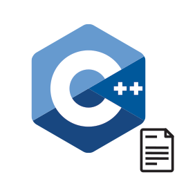

<div align="center">



</div>

# C++ Class Creator & Utilities

A lightweight VS Code extension that generates C++ class file (.hpp). It forces immediate workspace indexing by the clangd language server and uses a custom, zero-dependency compilation pipeline instead of heavy web frameworks.

## Features

### Class File Generation

* Generates synchronized header (`.hpp`) file directly within the targeted workspace directory.
* Automatically writes standard preprocessor header guards `#pragma once`.
* Generates associated attributes **getters** / **setters**.

### clangd Auto-Imports

* The extension leverages clangd's symbol resolution capabilities to automatically resolve missing **include** headers. When adding member attributes to a new class, the tool automatically imports the required headers directly into the generated files.

---

## Usage

1. Open your C++ project folder in VS Code.
2. Press **`Ctrl + Alt + C`** (or **`Cmd + Alt + C`** on macOS) to launch the class creator wizard.
3. Enter your class architecture parameters and generate your files.

---

## Technical Stack & Toolchain

The build system is designed for speed, compiling all source code into a single self-contained bundle with zero runtime dependencies:

* **Bundler:** `esbuild` handles TypeScript compilation and module bundling.
* **Styles:** The Tailwind CSS CLI generates layout utilities independently into a flat asset file.
* **Minification:** `html-minifier-terser` compresses and minifies the HTML templates at build time via a custom build script hook before they are packaged.

---

## Development and Compilation

### Prerequisites

* Node.js (v22.22 or higher)
* VS Code (1.109.0 or higher)
* clangd extension (optional) (**auto import feature**)

### Setup

Clone the repository and install the development dependencies:

```bash
git clone git@github.com:cinqdtun/cplusplus-class-creator-utilities.git
cd cplusplus-class-creator-utilities
npm install
```

### Installation

If you want to build and install the extension without using the VS Code Marketplace, you can bundle it locally into a `.vsix` file:

```bash
npm run package
```

### Building

A custom `esbuild.js` script handles the entire build pipeline. Using custom plugins, it manages output directory cleanup, asset compilation, and real-time stylesheet tracking during development.

| NPM Script | Operation | Behavior |
| --- | --- | --- |
| `npm run dev` | Development Watch | Purges the `dist/` directory, initializes the `esbuild` filesystem watch loop, and appends inline source maps for local debugging. |
| `npm run build` | Production Build | Purges the `dist/` directory, triggers the Tailwind CLI compilation, and minifies all script and template outputs. |
| `npm run package` | Standalone Packaging | Triggers a production compilation pass and bundles the extension into a local `.vsix` distribution file. |

---

## Extension Packaging

The packaging process uses `.vscodeignore` to strip out raw TypeScript sources, configuration files, and local media assets. The final `.vsix` bundle includes only the essential production files: the compiled output in `dist/`, `package.json`, `LICENSE`, and the documentation.

---

## License

This project is distributed under the terms of the GPL-3.0 License. See `LICENSE` for structural details.